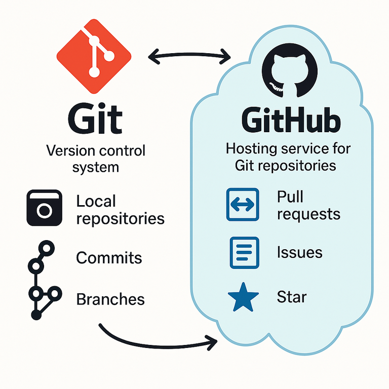
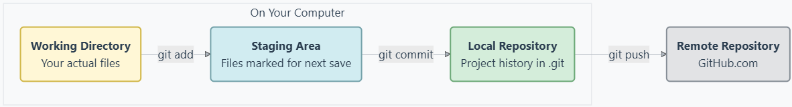
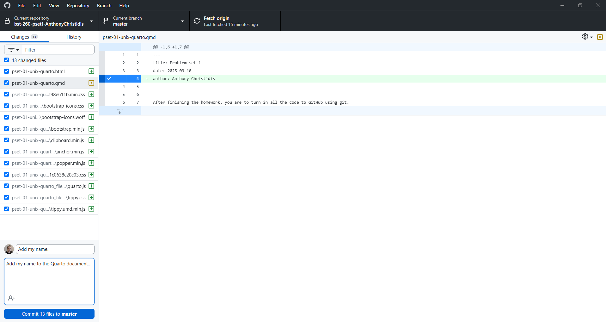

**[Tutorial Video](https://harvard.zoom.us/rec/play/P8gIF7BQKR4R56VxncMITXOFpIzR4EJ8pOLbsQGPte6d53V6R-crppuhIsC-dJW7_ZTMeg_g6mLrUCGq.v5ZJlVDDhQl_ISLs?eagerLoadZvaPages=sidemenu.billing.plan_management&accessLevel=meeting&canPlayFromShare=true&from=share_recording_detail&startTime=1757311077000&componentName=rec-play&originRequestUrl=https%3A%2F%2Fharvard.zoom.us%2Frec%2Fshare%2FsHYKGg8YpAc7zOjb8FaSLL096n3ZRFqYar2Kh7RYNJCCM3fgP88KjnaAUbrkZbVW.XQSb8JMBGl8BtG6S%3FstartTime%3D1757311077000)**

## Introduction: The "Final_v2_final_FINAL.docx" Problem

We've all been there. You're working on a big project, and your folder looks like this:

-   `report.docx`
-   `report_with_edits.docx`
-   `report_final.docx`
-   `report_final_REALLY_final.docx`
-   `report_final_for_prof_smith.docx`
-   `report_backup_monday.docx`

This is a messy, inefficient, and error-prone way to track changes. What if you want to go back to a version from last week? How do you safely merge your work with a collaborator's? And what if you want to try a new, experimental feature without breaking the main project?

These problems are all solved by **version control**. The world's most popular system, **Git**, lets you save snapshots of your work (*commits*) and create parallel timelines to work on new ideas (*branches*). While this guide covers the basics, mastering the branching workflow on GitHub is a key skill for collaborating on your final project and beyond.

## Section 1: What Are Git and GitHub?

People often use the terms "Git" and "GitHub" interchangeably, but they are two different things.

-   **Git** is the version control software that runs **on your local computer**. It's a command-line tool that tracks changes to your files. Think of it as a "time machine" for your project, allowing you to save "snapshots" (called **commits**) of your work and travel back to them at any time.

-   **GitHub** is a **website and cloud-based service** that hosts your Git repositories. It's a place to store your projects online so you have a backup and can easily collaborate with others. Think of it as a "Google Drive" or "Dropbox" specifically for your Git projects.

> **Analogy:** Git is the diary you write in on your desk at home. GitHub is the cloud service where you upload a copy of your diary for safekeeping and to share entries with friends.

The basic relationship looks like this:



## Section 2: How You "Talk" to GitHub (HTTPS vs. SSH)

When you want to `clone` (download) or `push` (upload) your code to GitHub, your computer needs to prove to GitHub that you are who you say you are. This is called **authentication**. There are two primary ways to do this:

### HTTPS (The "Login with Password" Method)

-   **What it is:** The URL looks like `https://github.com/user/repo.git`.
-   **How it works:** Each time you connect to GitHub, it might ask for your username and password (or a **Personal Access Token**, which is a more secure, modern replacement for passwords).
-   **Pros:**
    -   Very easy to get started.
    -   Works everywhere, even behind strict firewalls, because it uses the same port as regular web traffic.
-   **Cons:**
    -   Can be annoying to repeatedly enter your credentials (though helper tools can save them for you).
-   **Who should use it:** **Beginners!** It's the simplest way to get up and running. **GitHub Desktop** uses this method automatically and makes it painless.

### SSH (The "Use a Key" Method)

-   **What it is:** The URL looks like `git@github.com:user/repo.git`.
-   **How it works:** You generate a pair of cryptographic keys on your computer: a **private key** (which you keep secret) and a **public key** (which you give to GitHub). When you connect, your computer proves its identity using the private key, and GitHub verifies it using the public key you provided.
-   **Pros:**
    -   Extremely secure.
    -   After setup, you **never have to type your password** to `push` or `pull`. It's much faster for frequent command-line users.
-   **Cons:**
    -   Requires a one-time setup process that can be tricky for beginners.
    -   Can sometimes be blocked by corporate or university firewalls.
-   **Who should use it:** Anyone who plans to use the command line regularly. It's the preferred method for developers.

::: callout-note
### Our Recommendation

1.  **Start with GitHub Desktop.** It uses HTTPS and handles all authentication for you automatically. This is the fastest way to solve the "permission denied" error and get working on your assignments.
2.  **Set up SSH later.** Once you're comfortable with the Git workflow, take 15 minutes to set up SSH. It will make your command-line experience much smoother in the long run.
:::

## Section 3: The Core Git Workflow

Whether you use a GUI like GitHub Desktop or the command line, the underlying process is the same. There are four key steps in a typical workflow.




1.  **Modify Files (Working Directory):** This is just you, working on your project. You edit code, write text, add images, etc.

2.  **Stage Changes (`git add`):** You choose which of your modified files you want to include in your next "snapshot" (commit). This is like putting items into a cardboard box before you seal it.

    -   `git add file1.R` stages just that one file.
    -   `git add .` stages all modified files in the current directory and subdirectories.

3.  **Commit Changes (`git commit`):** You take the "snapshot" of all the files in the staging area. This saves it to your **local** repository history. Every commit has a unique ID and a message describing the changes. This is like sealing the box and writing a label on it.

    -   `git commit -m "Add initial data analysis script"`

4.  **Push Changes (`git push`):** You upload your new commits from your local repository to the remote repository on GitHub. This is how you back up your work and share it with others. This is like mailing the box.

    -   `git push`

## Section 4: Practical Guide 1 - The Easy Way with GitHub Desktop

GitHub Desktop is a graphical user interface (GUI) that makes using Git incredibly simple by abstracting away the command line.

### Step A: Setup (One Time Only)

1.  **Download and Install:** Get GitHub Desktop from [desktop.github.com](https://desktop.github.com/).
2.  **Log In:** Open the application and follow the prompts to log in with your GitHub account. It will handle all authentication for you.

### Step B: Cloning Your First Repository

1.  Go to the repository's page on GitHub.com.
2.  Click the green **`< > Code`** button.
3.  Select the **"Local"** tab, then click **"Open with GitHub Desktop"**.
4.  GitHub Desktop will open and ask you where on your computer you want to save the project. Choose a location and click **"Clone"**.

That's it! The repository is now on your computer.

### Step C: The Daily Workflow (Add, Commit, Push)

1.  **Make Changes:** Open the project folder in RStudio (or your editor of choice) and modify your files as usual.

2.  **Review and Commit:**

    -   Go back to GitHub Desktop. The "Changes" tab on the left will show you all the files you've modified (it shows you the "diffs" — the exact lines you added or removed).
    -   GitHub Desktop automatically "stages" all your changes.
    -   In the bottom-left corner, type a descriptive **commit message** in the "Summary" box.
    -   Click the **"Commit to master"** button.

    

3.  **Push to GitHub:**

    -   After you commit, a blue button will appear at the top saying **"Push origin"**.
    -   Click it. Your changes are now safely on GitHub!

## Section 5: Practical Guide 2 - The Powerful Way with Command Line + SSH

This method requires a one-time setup but is much more efficient for long-term command-line use.

### Step A: Setup - Generating and Adding Your SSH Key (One Time Only)

1.  **Open a Terminal.**

    -   On Mac: Use the Terminal app.
    -   On Windows: Use Git Bash (which comes with [Git](https://git-scm.com/downloads) for Windows) or [WSL](https://learn.microsoft.com/en-us/windows/wsl/install).

2.  **Generate a New SSH Key.**

    -   Paste the following command, replacing the email with your own GitHub email.
    -   Press Enter to accept the default file location and again for no passphrase (or enter one if you want extra security).

    ``` bash
    ssh-keygen -t ed25519 -C "your_email@example.com"
    ```

    ::: {.callout-note}
    ### Understanding SSH Key Pairs
    This command creates two files: a **private key** (`id_ed25519`) and a **public key** (`id_ed25519.pub`). Think of them as a lock and key pair. Your **private key stays on your computer and should never be shared**, i.e. it's like your house key. Your **public key can be safely shared with services like GitHub**, i.e. it's like giving someone your address so they can send you mail. Each private key has exactly one corresponding public key, and you typically only need one key pair per computer. You can use the same public key on multiple services (GitHub, GitLab, etc.).
    :::

3.  **Add the Key to the SSH Agent.**

    -   This ensures your key is automatically used when you run git commands.

    ``` bash
    # Start the ssh-agent in the background
    eval "$(ssh-agent -s)"

    # Add your SSH private key to the ssh-agent
    ssh-add ~/.ssh/id_ed25519
    ```

4.  **Copy Your Public Key.**

    -   This is the key you will give to GitHub.

    ``` bash
    # On macOS
    pbcopy < ~/.ssh/id_ed25519.pub

    # On Windows (in Git Bash)
    cat ~/.ssh/id_ed25519.pub | clip

    # On Linux
    # If you have xclip installed:
    xclip -selection clipboard < ~/.ssh/id_ed25519.pub
    # Otherwise, just print it and copy it manually:
    cat ~/.ssh/id_ed25519.pub
    ```

5.  **Add the Key to GitHub.**

    -   Go to [github.com](https://github.com).
    -   Click your profile picture in the top-right and go to **Settings**.
    -   In the left sidebar, click **"SSH and GPG keys"**.
    -   Click **"New SSH key"**.
    -   Give it a descriptive **Title** (e.g., "My MacBook Pro").
    -   Paste your public key into the **"Key"** field.
    -   Click **"Add SSH key"**.

### Step B: Cloning with SSH

1.  Go to the repository's page on GitHub.com.

2.  Click the green **`< > Code`** button.

3.  Select the **SSH** tab. The URL should start with `git@github.com:...`.

4.  Click the copy button.

5.  In your terminal, navigate to where you want to store the project, and run:

    ``` bash
    git clone git@github.com:USER/REPO_NAME.git
    ```

### Step C: The Daily Workflow (Add, Commit, Push)

1.  **Navigate into your project directory.**

    ``` bash
    cd REPO_NAME
    ```

2.  **Make Changes:** Edit your files in RStudio.

3.  **Check Status:** See what you've changed.

    ``` bash
    git status
    ```

4.  **Stage your changes.**

    ``` bash
    # Stage a single file
    git add pset-01.qmd

    # Or, stage all changes
    git add .
    ```

5.  **Commit your staged changes.**

    ``` bash
    git commit -m "Finish quadratic formula and add plot"
    ```

6.  **Push your commit to GitHub.** Because you set up SSH, this will work without a password.

    ``` bash
    git push
    ```

## Additional Topics & Best Practices

Now that you know the basic workflow, let's cover a few more essential concepts and best practices that will make your experience with Git and GitHub much smoother, especially when collaborating.

### Keeping in Sync: `git pull`

What happens if a partner pushes a change to the GitHub repository while you're working? Your local version is now out of date. To update it, you use `git pull`.

`git pull` fetches the latest changes from the remote repository (GitHub) and merges them into your local working directory.

> **Best Practice:** Always run `git pull` before you start working on a project, and again right before you `git push` your own changes. This helps prevent "merge conflicts," where Git gets confused by simultaneous edits to the same file.

### Writing Good Commit Messages

Your commit messages are a log of your project's history. They are a communication tool for your future self and for your teammates. A vague message like "updated file" is useless. A good commit message follows a simple convention:

1.  **The Subject Line:** A short summary (under 50 characters) written in the present tense, imperative mood. Think of it as a command:
    -   **Good:** `Add initial data analysis script`
    -   **Bad:** `added a script` or `adding the script`
2.  **The Body (Optional):** After the subject line, leave a blank line and write a more detailed explanation. Describe the *what* and the *why*, not the *how* (the code itself shows the *how*).

**Example of a great commit:**

    Fix bug in quadratic formula calculation

    The formula was not correctly handling cases where the discriminant
    was zero, leading to a single NA instead of one real root. This
    commit adds a specific check for discriminant == 0.


### The Art of the Commit: Frequency and Content

How often should you commit? What should go into a single commit?

The goal is to make **atomic commits**: each commit should represent a single, logical, self-contained change. Think of commits as small, logical steps in a recipe, not just one big "cooked the meal" commit at the end.

-   **Do:** Commit when you've completed a small task, like fixing one bug, adding one new function, or completing the first part of a problem set question.
-   **Don't:** Lump unrelated changes together (e.g., fixing a typo in the README, adding a new plot, and changing a variable name should ideally be separate commits).
-   **Don't:** Commit broken code that will prevent a collaborator (or yourself) from running the project.

> **Mantra to remember:** Commit early, commit often. Small, frequent commits are easier to understand and, if necessary, to undo.

### Recommended Reading

The topics in this guide are just the beginning. To prepare for the final project and for using version control professionally, we highly recommend exploring these resources:

-   **Chapter 19** of the course textbook, which provides another overview of these concepts.
-   **The first two chapters of *Pro Git*** by Scott Chacon and Ben Straub. This is considered the definitive guide to Git. It's available for free online, and the initial chapters perfectly explain the foundational ideas behind version control. You can read it at <https://git-scm.com/book/en/v2>.

------------------------------------------------------------------------

That's it! You now know the difference between Git and GitHub, how to authenticate with HTTPS and SSH, and the fundamental workflow for versioning your projects using both a friendly GUI and the powerful command line.